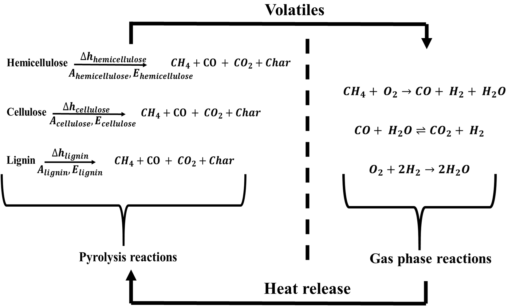

**A reduced wood pyrolysis mechanism to estimate solid and gas parameters**

This repository provides the Chemkin (.ck) source file containing the thermodynamic properties (Cp, H, and S) and the reaction rate parameters for both solid phase degradation (pyrolysis) and gas phase combustion reactions that form the basis of a reduced wood pyrolysis mechanism developed at Virginia Tech. A transport (.dat) file corresponding to the gas phase transport parameters produced by the GRI30 mechanism is also provided. This wood pyrolysis mechanism can account for solid phase mass loss and gas phase heat release simultaneously. This mechanism leverages simultaneous thermal analyzer (STA) and gas chromatograhy (GC) experiments conducted at the Extreme lab at Virginia Tech to construct a three-step pyrolysis mechanism. Using the experiments, model fitting algorithms, and least-square minimizations, this reduced mechanism can output pyrolysis (solid phase) mass loss rates, pyrolysis (solid phase) energies of decomposition, and gas phase composition, heat release rates. The mechanism was validated using experiments conducted across three different heating rates (5, 10, and 20 K/min). Additional information about experiments and model development is provided in the following publication:

Banagiri S., Parameswaran M., Khadakkar I., Meadows J., Lattimer B. Y., A reduced wood pyrolysis mechanism for evaluating solid and gas phase parameters, Fuel 381 (2025) 133416, https://doi.org/10.1016/j.fuel.2024.133416.

**Usage Instructions:**

<!--This code is meant to be provide a framework for developing pyrolysis mechanisms for various composite materials. The various quantitative parameters derived using the code are meant for mixed hardwood species only. However, researchers can use the algorithms provided here in conjunction with micro-scale experiments (TGA/DSC and GC) to obtain pyrolysis parameters for specific materials. Keeping this caveat in mind, the following steps describe how this code can be used to compute relevant pyrolysis parameters. The steps below aim to construct a reduced wood pyrolysis mechanism that has the following reactions. Pyrolysis reaction rates, gaseous species production rates, the enthalpies of reactions for the pyrolysis reactions and the gaseous phase combustion heat release are estimated using the following algorithm.-->
The mechanism formulates the solid phase and gas phase combustion simultaneously as shown in the figure below. The various quantities parameters derived in this mechanism are meant for mixed hardwood species only. However, researchers can use the methodology provided in the authors' [previous publication](https://doi.org/10.1016/j.fuel.2024.133416) to derived similar parameters for various composite materials. Keeping this caveat in mind, the following steps describe how this mechanism was obtained. The steps below aim to construct a reduced wood pyrolysis mechanism that has the following reactions. Pyrolysis reaction rates, gaseous species production rates, the enthalpies of reactions for the pyrolysis reactions and the gaseous phase combustion heat release are estimated using the following algorithm.



<!--1. This code requires the usage of ```pandas```, ```numpy```, and ```scipy``` libraries. The code also requires the usage of the ```cantera``` package. Using ```cantera```, a mechanism file containing relevant pyrolysis gases for your application. The pyrolysis gases present in your application can be estimated using GC experiments.2. Next, read the mass loss data from your TGA experiments at different heating rates and apply a smoothing function (Savitzky-Golay filter in this code) to remove noise in the dataset. After smoothing the mass loss TGA data, compute the mass loss rate at different heating rates.-->

1. A differential evolution algorithm is used to fit the experimental mass loss rates (from TGA experiments) for the three different heating rates (5, 10, and 20 K/min). To do this, wood pyrolysis is assumed to occur through three independent, parallel, first-order degradation reactions involving the three pseudocomponents (hemicellulose, cellulose, and lignin) that make up the lignocellulosic biomass. The degradation rate for each pseudocomponent j ($$\frac{df_j}{dt}$$) is assumed to follow the equation below. This equation is written for the TGA fraction of pseudocomponents.
   
$$
\frac{df_j}{dt} = -f_j A_j \exp \left(-\frac{E_j}{RT} \right)
$$

2. The TGA fractions for the pseudocomponents and the residual char fraction ($$f_{res}$$) add up to give the total TGA fraction ($$f_{total}$$) as shown below. The residual char fraction is taken to be 0.265. This value was obtained from TGA experiments conducted at the Extreme lab at Virginia Tech. Using these equations and the differential evolution algorithm, the Arrhenius rate parameters $$A_j$$ (1/s) and $$E_j$$ (J/mol) are obtained.
   
$$
f_{total} = \sum_{j=1}^{3} f_j + f_{res}
$$
   
3. After the Arrhenius rate parameters for the three reactions are obtained, the massfractions of the pseudocomponents and char are obtained using the following equation

$$
Y_j = \frac{f_j}{1 - f_{res}}
$$

4. Using the estimated mass fractions, the effective sensible specific heat of the wood sample is taken as the mass-weighted average of specific heats of individual pseudocomponents and char as shown in the equation below. This equation requires the specific heats of individual pseudocomponents and char.

$$
C_{effective} = \sum_{j=1}^{3} C_j + C_{char}
$$

5. To find the specific heats mentioned above, the total heat flow computed from the DSC experiments conducted at the Extreme lab at Virginia Tech was used to compute the apparent specific heat as shown in the equation below. The apparent specific heat includes the contribution of sensible specific heat, enthalpies of pyrolysis reactions, and the enthapies of gaseous species. The effective sensible specific heat needs to be separated from the pyrolysis decomposition and gaseous species contributions. In order to achieve this, the code assumes that the apparent specific heat is equivalent to the effective sensible specific heat of wood sample when the progress variable for pyrolytic degradation $$e \leq 0.05$$. Furthermore, the apparent specific heat is assumed to be equivalent to the char specific heat ($$C_{char}$$) when $$e \geq 0.95$$. This way, the char sensible specific heat ($$C_{char}$$) is computed.

$$
C_{apparent} = \frac{\dot{Q}_{DSC}}{m \frac{dT}{dt}}
$$

6. Using the known value of $$C_{effective}$$ for $$e \leq 0.05$$, the pseudocomponent specific heats $C_j$ are computed using a non-linear least squares optimization function. The pseudocomponent specific heats agree favorably with results obtained by various studies in the literature including by [C. Qi et al.](https://doi.org/10.1515/hf-2019-0285), [Comesana et al.](https://www.tandfonline.com/doi/full/10.1179/1743967112Z.00000000055), [Gorensek et al.](https://pubs.acs.org/doi/10.1021/acssuschemeng.9b01278?src=getftr&utm_source=sciencedirect_contenthosting&getft_integrator=sciencedirect_contenthosting), [Hatakeyama et al.](https://doi.org/10.1016/0032-3861(82)90125-2), and [Voitkevich et al.](https://pubs.acs.org/doi/10.1021/je2012814?src=getftr&utm_source=sciencedirect_contenthosting&getft_integrator=sciencedirect_contenthosting).

7. After computing the pseudocomponent specific heats, the algorithm computes the volatile fractions of the species produced. The volatile fractions are defined as the coefficients relating the pseudocomponent mass loss rates (as computed using the differential evolution optimization algorithm) and the experimental gaseous species mass flow rates $$\dot{m_i}$$ as measured by the gas chromatography. The volatile fractions $$\psi_{i, j}$$ (as shown in the equation below) are obtained using the least squares optimization algorithm. $$\psi_{i, j}$$'s are obtained for gas chromatography measurements conducted at a heating rate of 5 K/min. The estimated $$\psi_{i, j}$$'s are then tested on the species mass flow rates measured by gas chromatography measurements conducted at a heating rate of 1 K/min. In this way, the volatile fractions are verified. The volatile fractions can be used to predicted species mass flow rates at any given heating rate.

$$
\dot{m_i} = \psi_{i, j} \frac{d m_j}{dt} 
$$

8. Once the species mass flow rates are estimated, the gaseous mixture enthalpies can be computed using Cantera. Using a 1D energy balance derived in the [authors' previous publication](https://doi.org/10.1016/j.fuel.2024.133416), the heat of decomposition for the three pyrolysis reactions is estimated using the equation and the least squares optimization below. The heats of decompositon are estimated by solving the least squares optimization problem for DSC experiments conducted at a heating rate of 5 K/min. These heats of decomposition values are then validated for heating rates of 10 K/min and 20 K/min.

$$
f C_{effective} \frac{\partial T}{\partial t}+ \sum_{j=1}^3\left(\left(\Delta h_j+\int_{T_{r e f}}^T C_j \partial T-\int_{T_{r e f}}^T C_{p, g, j} \partial T\right) \frac{\partial f_j}{\partial t}\right) =\frac{\dot{Q_{DSC}}}{m_{virgin}}
$$

$$
\min_{\Delta h_j} \frac{1}{2} \sum_{T} \left( f_T C_{\text{effective}, T} \frac{\partial T}{\partial t} + \sum_{j=1}^3 \left( \left( \Delta h_j + \int_{T_{\text{ref}}}^T C_{j, T} \, dT - \int_{T_{\text{ref}}}^T C_{p, g, j, T} \, dT \frac{\partial f_{j, T}}{\partial t} \right) \right) - \frac{\dot{Q_{\text{DSC}, T}}}{m_{\text{virgin}}} \right)^2
$$

9. By using the predicted composition of the pyrolysis gas, the heat release rate is estimated using a 0D constant pressure reactor. The gas phase heats of reaction and reaction rates are computed using the four-step methane combustion mechanism provided by Peters and Williams in [this](https://doi.org/10.1016/0010-2180(87)90057-5) study. The time-varying heat release rates are validated against studies by [Xu et al.](https://doi.org/10.3390/polym14010045) and [Hostikka and Matala](https://doi.org/10.1080/00102202.2017.1295959). In this manner, the reduced pyrolysis mechanism accounts for both the solid and gas phase parameters.


**Citation:**

While referring to the code provided here, please cite the following article:

```
@article{BANAGIRI2025_pyro_mech,
title = {A reduced wood pyrolysis mechanism for evaluating solid and gas phase parameters},
journal = {Fuel},
volume = {381},
pages = {133416},
year = {2025},
issn = {0016-2361},
doi = {https://doi.org/10.1016/j.fuel.2024.133416},
url = {https://www.sciencedirect.com/science/article/pii/S0016236124025651},
author = {Shrikar Banagiri and Manjunath Parameswaran and Ishanee Khadakkar and Joseph Meadows and Brian Y. Lattimer},
keywords = {Wood pyrolysis, Reduced kinetics, Thermogravimetry, Thermal degradation, Combustion},
abstract = {A reduced wood pyrolysis mechanism comprising of three parallel, first-order reactions was developed to model solid phase heat flow and gas phase combustion parameters. To this end, simultaneous thermal analyzer (STA) studies on a mixed hardwood sawdust sample were conducted for different heating rates (5, 10, and 20 K/min). A nonlinear least-squares model-fitting algorithm was used to extract the Arrhenius kinetic parameters from these experiments. Gaseous species mass flow rates at 1 K/min and 5 K/min were measured by a gas chromatograph (GC) coupled with the STA. The concept of volatile fractions was introduced to correlate the species mass flow rates to the pseudo-component (hemicellulose, cellulose, and lignin) mass loss rates. Sensible specific heats of individual pseudo-components and char were found by using their mass fractions and a progress variable for the degradation. Using the kinetic parameters, gas phase mass fractions, and sensible specific heats, the heats of decomposition of the pseudo-components were evaluated. These parameters formed the inputs of a solid phase heat flow model. This solid phase model was validated against differential scanning calorimetry (DSC) data. The gas phase composition generated by the reduced mechanism was validated against micro-combustion calorimeter (MCC) experiments at different heating rates. The proposed mechanism can be used in wood combustion studies wherein the solid phase heat flow and gas phase combustion processes are coupled. Furthermore, this methodology can be extended to the degradation of any composite material.}
}
```

**Acknowledgment:**

This work was supported by the United States Department of Energy (DOE) through the Office of Energy Efficiency and Renewable Energy (EERE), Project Number: DE-EE0009770. This project is a collaborative effort between the University of Alabama and Virginia Tech. 
